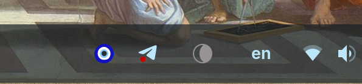

## Nazar Blocker GTK

<<<<<<< HEAD
Protect your computer from nazar.

For the QT one: [https://github.com/sulincix-other/nazar-blocker](https://github.com/sulincix-other/nazar-blocker)
=======
A minimal system tray application to protect your computer from nazar (the evil eye). Implemented in GTK 3 with AppIndicator support.
>>>>>>> 22e26c7 (Update Readme.md with detailed installation instructions and troubleshooting tips)



## Features
- Lightweight system tray icon
- Multi-language support (English, Turkish)
- AppIndicator integration for modern Linux desktops
- Single binary, no external dependencies at runtime

## Prerequisites

### Ubuntu/Debian
```sh
sudo apt install libgtk-3-dev libayatana-appindicator3-dev meson ninja-build gettext gcc
```

### Fedora/RHEL
```sh
sudo dnf install gtk3-devel libayatana-appindicator-devel meson ninja-build gettext gcc
```

### Arch
```sh
sudo pacman -S gtk3 libayatana-appindicator meson ninja gettext base-devel
```

**Essential packages:**
- GTK 3 development headers
- libayatana-appindicator3 (or libappindicator3 on older systems)
- Meson build system
- Ninja build tool
- gettext (for translations)
- C compiler (gcc or clang)

## Building

### Setup
```sh
meson setup builddir
cd builddir
```

### Compile
```sh
ninja
```

### Build with verbose output (for debugging)
```sh
ninja -v
```

The compiled binary will be at `./nazar`.

## Installation

### Option 1: Run from build directory (development)
```sh
./builddir/nazar
```

### Option 2: System-wide installation
```sh
cd builddir
sudo ninja install
sudo gtk-update-icon-cache /usr/share/icons/hicolor
```

After system installation, run:
```sh
nazar
```

The binary installs to `/usr/local/bin/nazar` by default.

### Custom installation prefix
```sh
meson setup builddir --prefix=$HOME/.local
cd builddir && ninja
ninja install
gtk-update-icon-cache $HOME/.local/share/icons/hicolor
```

Then run with:
```sh
$HOME/.local/bin/nazar
```

## Packaging

### Creating a .desktop file for application menus

Create `~/.local/share/applications/nazar.desktop`:
```ini
[Desktop Entry]
Name=Nazar Blocker
Comment=System tray application for protection from the evil eye
Exec=nazar
Type=Application
Categories=Utility;
Icon=nazar
Terminal=false
```

After installation, update the application cache:
```sh
update-desktop-database ~/.local/share/applications
```

### Icon theme
The application icon (`nazar.svg`) is installed to:
```
$PREFIX/share/icons/hicolor/scalable/apps/nazar.svg
```

On system installation (`--prefix=/usr/local`), the icon path is:
```
/usr/local/share/icons/hicolor/scalable/apps/nazar.svg
```

To manually register the icon:
```sh
gtk-update-icon-cache /usr/share/icons/hicolor
```

### Building a distribution package

**Debian/Ubuntu (.deb)**
```sh
# Create a debian/ directory and follow Debian packaging guidelines
# Then build with dpkg-buildpackage
dpkg-buildpackage -us -uc
```

**Fedora (.rpm)**
```sh
# Create a .spec file and use rpmbuild
rpmbuild -ba nazar.spec
```

## Troubleshooting

### Build fails with "Dependency X not found"
Ensure you've installed all prerequisites for your distribution (see above).

### gettext/translations not compiling
Install gettext:
```sh
sudo apt install gettext  # Ubuntu/Debian
sudo dnf install gettext  # Fedora
sudo pacman -S gettext    # Arch
```

Then rebuild:
```sh
rm -rf builddir
meson setup builddir
cd builddir && ninja
```

### System tray icon not appearing
- Ensure your desktop environment supports AppIndicator (GNOME, KDE, Xfce, Cinnamon, etc.)
- Check that the icon cache is updated: `gtk-update-icon-cache /usr/share/icons/hicolor`
- Some minimal window managers may not support system tray icons

### Uninstalling
```sh
cd builddir
sudo ninja uninstall
```
